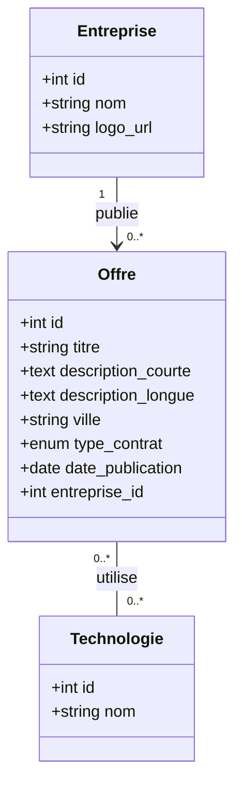
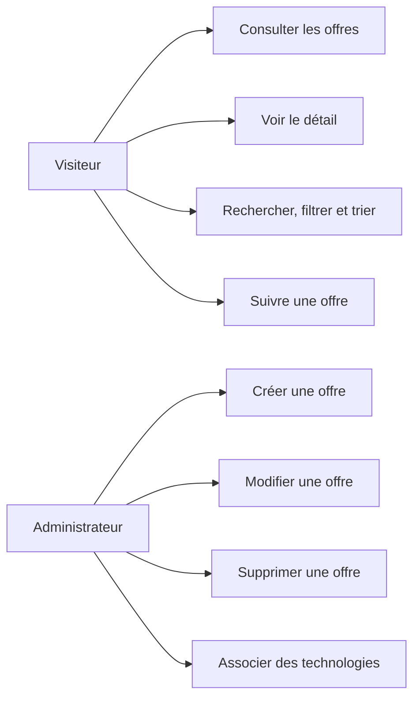
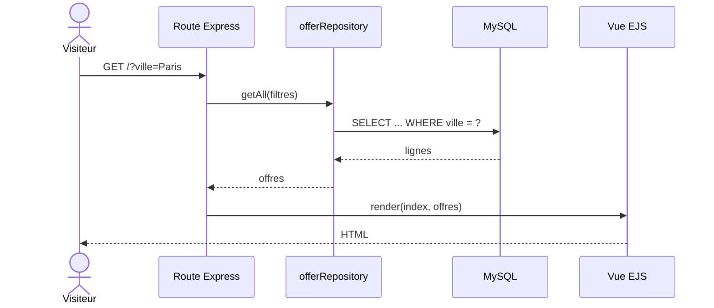
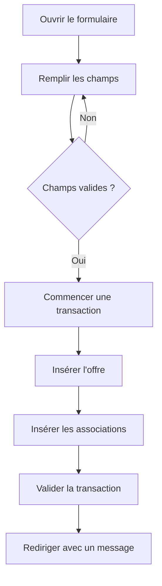

# Conception du JobBoard

## Diagramme de classes UML

Une entreprise peut publier zéro ou plusieurs offres. Une offre appartient à une seule entreprise. Une offre peut utiliser plusieurs technologies et une technologie peut être liée à plusieurs offres.

## Diagramme de cas d'utilisation

## Modèle relationnel logique

- **entreprise** (**id**, nom, logo_url)
- **offre** (**id**, titre, description_courte, description_longue, ville, type_contrat, date_publication, *entreprise_id*)
- **technologie** (**id**, nom)
- **offre_technologie** (**offre_id**, **technologie_id**)

`offre.entreprise_id` référence `entreprise.id`. La clé primaire composée de `offre_technologie` évite de lier deux fois la même technologie à la même offre. Ses deux colonnes sont aussi des clés étrangères.

## Diagramme du flux d'affichage

## Parcours de création

## Protection des requêtes

Les valeurs utilisateur ne sont jamais ajoutées directement dans une chaîne SQL. Les repositories utilisent des placeholders `?` et fournissent les valeurs séparément à `mysql2`. Le tri est limité dans le code à deux constantes, `ASC` ou `DESC`.
